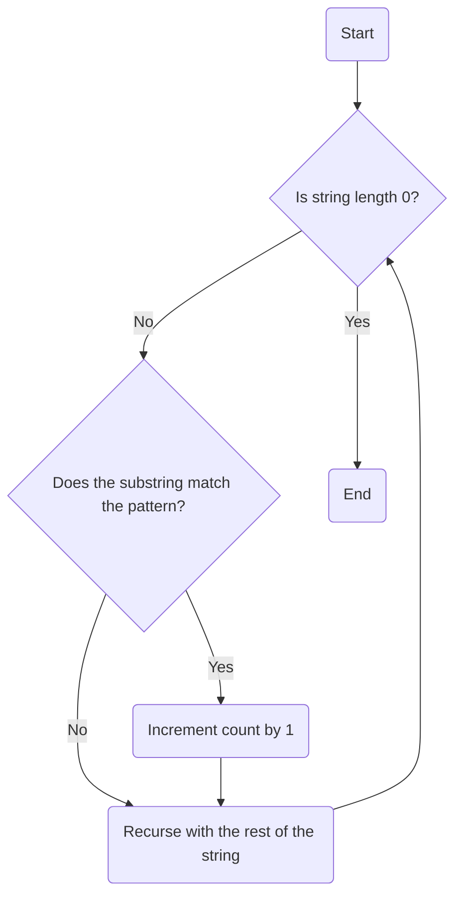
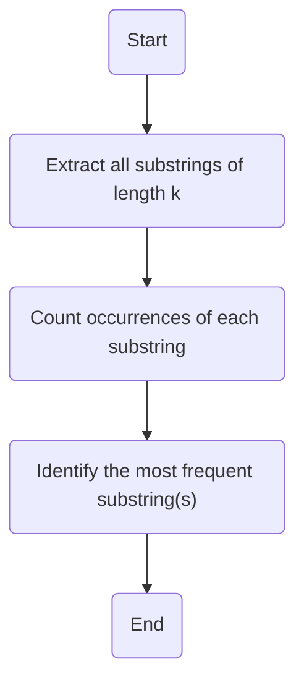

# Lib.hs: String Pattern Analysis

## Overview
This module provides functionality for analyzing patterns within strings. It includes methods to count occurrences of a specific pattern in a string and to identify frequent patterns of a given length.

## Process Flow

### Pattern Count (`patternCount`)
The `patternCount` function calculates the number of times a specific pattern appears in a given string.

### Frequent Words (`frequentWords`)
The `frequentWords` function identifies the most frequent patterns of a specified length (`k`) in a given text. The implementation details are not provided.

## Insights
- The `patternCount` function uses recursion to traverse the string and count pattern matches.
- The `frequentWords` function is designed to find the most frequent substrings of a specified length, but its implementation is incomplete.
- The `patternCount` function uses the `take` function to extract substrings for comparison.
- The `where` clause is used to define helper variables like `patternLength` for better readability.

## Dependencies
No external dependencies are detected.
